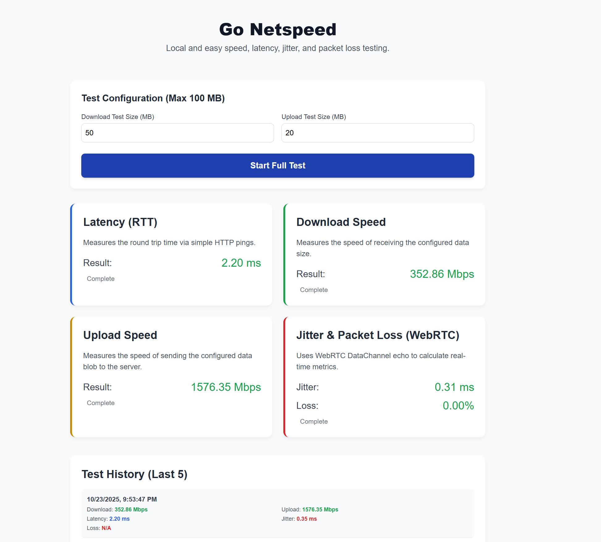

# Go-NetSpeed
A single file speedtest utility, allowing for a quick test of speed between a server system and clients on web browsers. _Generated with AI assistance for my own use._

## Usage
1. Run the server executable - allowing firewall access as needed
2. On client machines - test connections at http://SERVER:8080

### Command line options for the server
| Flag | Description | Default Value |
| -- | -- | -- |
| port  | The port to run the server on. | 8080 |
| maxsize  | Maximum download size in MB (capped at 1024 MB). | 100 |
| chunksize  |  Download chunk size in bytes, lower it for lower RAM utilization | 1048576 |
| webrtc-min-port  | Min port for WebRTC connections. Useful for docker. | 0 |
| webrtc-max-port  | Max port for WebRTC connections. Useful for docker.  | 0 |
| badger-path | What folder to store the database of shared results | badger_data |
| verbose  |  Pass -verbose to get connection messages | false |

